===============================
A Blender to Sketch 3d Exporter
===============================

:Author: Kjell Magne Fauske
:Version: 2.0dev
:Licence: MIT

About
=====

The ``sketch_export.py`` script is a simple tool for exporting Blender_ objects to the `Sketch`_ scene description language. Sketch is a small, simple system for producing line drawings of two- or three-dimensional solid objects and scenes. Sketch outputs PGF/TikZ or PSTricks code suitable for use in TeX/LaTeX documents. A unique feature of Sketch is that you can easily use LaTeX to annotate your drawings.

More information about Sketch:

- `Sketch online manual`_
- `An introduction to Sketch for PGF and TikZ users`_
- `Three dimensional graphics, illustrations and animations`_

.. _Blender: http://www.blender.org/
.. _Sketch: http://www.frontiernet.net/~eugene.ressler/
.. _Sketch online manual: http://www.frontiernet.net/~eugene.ressler/sketch.html
.. _An introduction to Sketch for PGF and TikZ users: http://www.fauskes.net/nb/introduction-to-sketch/
.. _Three dimensional graphics, illustrations and animations: http://www.fauskes.net/nb/threedill/

Requirements
------------

- Written and tested using Blender 2.48.
- Sketch version 0.2 (build 27) or later is required for all features to work.

How it works
------------

Sketch accepts a small domain-specific language. The export scripts basically outputs mesh faces as polygons_ and edge-only meshes (curves, poly lines) lines_. In addition materials are applied to the polygons as options_

.. _polygons: http://www.frontiernet.net/~eugene.ressler/sketch.html#Polygons
.. _lines: http://www.frontiernet.net/~eugene.ressler/sketch.html#Lines
.. _options: http://www.frontiernet.net/~eugene.ressler/sketch.html#Options

Features
========

The following Blender objects are exported:

- Meshes
- Curves. Converted to a poly lines when exported
- Empties. Exported as coordinates
- Materials
- Camera. The active camera can be used to set a view similar to Blender's.

Usage
=====

Select the objects you want to export and invoke the script from the ``File->Export``. Alternatively you can load and run the script from inside Blender. For more information, see for instance the alienhelpdesk_ `using python scripts`_ page.

.. _alienhelpdesk: http://www.alienhelpdesk.com/home
.. _using python scripts: http://www.alienhelpdesk.com/using_python_scripts

.. note::

    For the script to appear in Blender's export menu, you have to put the file in Blender's ``scripts`` folder. Blender will then automatically detect the script upon startup.

A GUI will appear where you can set various options.

Options
=======

When you run the export script a simple pop-up window will appear where you can set various export options:

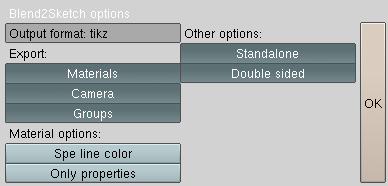

   Export options

Output format
    Allowed values are ``tikz`` and ``pstricks``. Sets the output format Sketch will use to create the final drawing.

Export materials
    When enabled, materials assigned to an object will be exported. See the Materials_ section for more details.

Camera
    Set up a view similar to Blender's active camera.

Export groups
    Aggregate `grouped objects`_ in a definition_. The group name is used as identifier_.

Spe line color
    Use the specular color as polygon line color.

Only properties
    If a ``polyoptions`` or ``lineoptions`` property is assigned to the property apply only the property values. The default behavior is to apply both material values, like color and opacity, and the custom options.

Standalone
    Create a stand-alone sketch file.

Double sided
    When enabled, culling is disabled for objects with the ``Double sided`` button set.

.. _grouped objects: http://wiki.blender.org/index.php/Manual/Groups_and_Parenting#Grouping_objects
.. _identifier: http://www.frontiernet.net/~eugene.ressler/sketch.html#Identifiers

Exported objects
================

Drawables
---------

All drawable objects are exported as polygons or poly lines. Non-mesh objects like curves and surfaces will be converted to a mesh when exported. Each face in a mesh will be saved as a polygon_. If the mesh does not has any faces, edges will be saved as lines_. A curve is an example of a mesh with only edges.

.. _polygon: http://www.frontiernet.net/~eugene.ressler/sketch.html#Polygons

Each object/mesh is grouped in a definition_ with the same name as the exported object:

.. sourcecode:: sketch

    def objectname {
        polygon[options] ...% face vertices
        line[options] ... % edge vertices
    }

.. _definition: http://www.frontiernet.net/~eugene.ressler/sketch.html#Definitions

The ``options`` value depends on the materials_ assigned to the object and `custom properties`_.

Along with each object the origin and the directions of the x, y and z axes are saved:

.. sourcecode:: sketch

    def objectname_o (x,y,z) % origin coordinate
    def objectname_x [x,y,z] % x-axis vector
    def objectname_y [x,y,z] % y-axis vector
    def objectname_z [x,y,z] % z-axis vector
    def objectname {
        ...
    }

The origin is a point_ literal_, while the axes are vector_ literals. The information is provided to make it easier to translate, rotate and manipulate objects in Sketch.

.. note::

    Global Blender coordinates are currently used when exporting objects. No scaling is performed. One Blender units (BU) is one Sketch unit. The size of the final drawing depends on Sketch and the output format.

.. _point: http://www.frontiernet.net/~eugene.ressler/sketch.html#Point-and-vector-literals
.. _vector: http://www.frontiernet.net/~eugene.ressler/sketch.html#Point-and-vector-literals
.. _literal: http://www.frontiernet.net/~eugene.ressler/sketch.html#Literals
.. _literals: http://www.frontiernet.net/~eugene.ressler/sketch.html#Literals

Empties
-------

Empties are exported as point_ literals_. Example. If a scene contains two empties named ``A`` and ``B``, they will be saved as:

.. sourcecode:: sketch

    def A (x1,y1,z1)
    def B (x2,y2,z2)

Empties can be very useful for placing Sketch specials_. To place labels at the coordinates defined above, you can for instance write:

.. sourcecode:: sketch

    special |\path #1 node {Label $A$}
                   #2 node {Label $B$};|(A)(B)

The code inside the special is in this case TikZ code. The corresponding PSTricks code is:

.. sourcecode:: sketch

    special |\uput[u]#1{Label $A$}
             \uput[u]#2{Label $B$}|(A)(B)

.. _specials: http://www.fauskes.net/nb/introduction-to-sketch/#specials

Materials
=========

The Sketch exporter supports a tiny subset of Blender's material properties:

- ``Col``. The diffuse color will be used as fill color for objects with faces. For curves and edge-only objects, ``col`` is used as stroke color.

- ``Spe``. Used as stroke color for faces/polygons if the ``Spe line color`` option is enabled.

- ``Alpha``. Fill opacity for faces and stroke opacity for curves and edge-only objects.

You can also add Sketch specific options using `custom properties`_.

Custom properties
=================

Blender allows saving custom data in many of the internal data types, including objects and materials. These are called ID properties. You can create and edit such properties using the ``ID Property Browser`` script found in the ``Help`` menu.

You can use ID properties to specify special Sketch and output format options. The following properties are supported:

``polyoptions``
    A string property where the value must be valid Sketch options. The value will be applied to faces only. Example::

        line style=thick, draw=red, fill=blue!20

``lineoptions``
    A string property where the value must be valid Sketch options. The value will be applied to curves and edge-only objects. Example::

        draw=red, arrows=->

The export script will look for the custom properties in both objects and materials.

.. note::

    It is straight forward to manually edit material properties in the generated code.

Missing faces and culling
=========================

Sketch uses `back-face culling`_ to reduce the number of generated polygons and hence reduce the drawing time. See the `Drawing a solid`_ section of the Sketch manual for more details. Unfortunately this sometimes gives unwanted results, like missing faces. There are a few things you can do to avoid this:

- Make sure that the face normals point outwards. You can use the ``Mesh->Normals->Recalculate Outside`` function in Edit mode to do this.
- Manually add ``cull=false`` to the object's or material's ``polyoptions`` property.
- Enable the ``Double Sided`` option in the Mesh panel. This will insert the ``cull=false`` option for each face. Note that this requires you to enable the the ``Double sided`` export option.

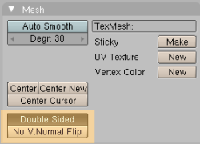

.. note::

    Transparency does not work well for objects with culling enabled.

.. _back-face culling: http://en.wikipedia.org/wiki/Back-face_culling
.. _Drawing a solid: http://www.frontiernet.net/~eugene.ressler/sketch.html#Drawing-a-solid

Examples
========

The export scripts features are best described with a few basic examples.

The default Blender scene
-------------------------

We will start by exporting the basic blender scene:

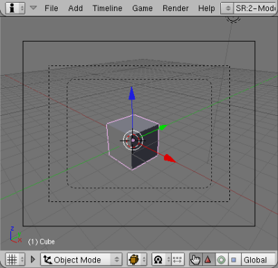

   Default Blender scene

The generated Sketch code will look something like this:

.. sourcecode:: sketch

    # Generated by sketch_export.py v 0.2dev
    % Materials section
    special |\definecolor{Material}{rgb}{0.800000011921,0.800000011921,0.800000011921}|[lay=under]
    def Material_poly [fill=Material]
    def Material_line [draw=Material]

    % Mesh section

    def Cube_o (0.000000,0.000000,0.000000)
    def Cube_x [1.000000,0.000000,0.000000]
    def Cube_y [0.000000,1.000000,0.000000]
    def Cube_z [0.000000,0.000000,1.000000]
    def Cube {
        polygon[Material_poly](1.000000,1.000000,-1.000000)(1.000000,-1.000000,-1.000000)(-1.000000,-1.000000,-1.000000)(-1.000000,1.000000,-1.000000)
        polygon[Material_poly](1.000000,0.999999,1.000000)(-1.000000,1.000000,1.000000)(-1.000000,-1.000000,1.000000)(0.999999,-1.000001,1.000000)
        polygon[Material_poly](1.000000,1.000000,-1.000000)(1.000000,0.999999,1.000000)(0.999999,-1.000001,1.000000)(1.000000,-1.000000,-1.000000)
        polygon[Material_poly](1.000000,-1.000000,-1.000000)(0.999999,-1.000001,1.000000)(-1.000000,-1.000000,1.000000)(-1.000000,-1.000000,-1.000000)
        polygon[Material_poly](-1.000000,-1.000000,-1.000000)(-1.000000,-1.000000,1.000000)(-1.000000,1.000000,1.000000)(-1.000000,1.000000,-1.000000)
        polygon[Material_poly](1.000000,0.999999,1.000000)(1.000000,1.000000,-1.000000)(-1.000000,1.000000,-1.000000)(-1.000000,1.000000,1.000000)
    }

    def scene {
        put {view((7.481132,-6.507640,5.343665),(0.010817,-0.895343,-0.445245),[0,0,1])}{
            {Cube}
        }
    }

    {scene}
    global {language tikz}

The Sketch code can then be converted to LaTeX code with::

    $ sketch -T basic.sk > basic.tex
    $ pdflatex basic.tex

The result is the familiar gray cube:

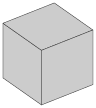

   Default Blender scene drawn by Sketch

A few observations from the code:

- The cube's assigned material is exported. The material is applied to the polygons using the ``Material_poly`` option.
- The object name is used to identify the object. In this case a ``Cube`` ``def`` is created.
- The object's origin is exported as a coordinate named ``Cube_o``.
- The object's x, y and z axes are exported as the vectors ``Cube_x``, ``Cube_y`` and ``Cube_z``.

A box with a transparent lid
----------------------------

Let's spice up the default Blender cube a bit by turning it into a box with a transparent lid:

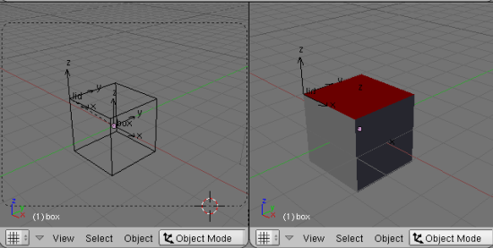

After exporting the example we get the following code:

.. sourcecode:: sketch

    % Materials section
    special |\definecolor{boxmat}{rgb}{0.699999988079,0.699999988079,0.699999988079}|[lay=under]
    def boxmat_poly [fill=boxmat]
    def boxmat_line [draw=boxmat]
    special |\definecolor{lidmat}{rgb}{0.699999988079,0.0,0.0}|[lay=under]
    def lidmat_poly [fill=lidmat,fill opacity=0.559678137302]
    def lidmat_line [draw=lidmat]

    % Mesh section

    def box_o (0.000000,0.000000,0.000000)
    def box_x [1.000000,0.000000,0.000000]
    def box_y [0.000000,1.000000,0.000000]
    def box_z [0.000000,0.000000,1.000000]
    def box {
      polygon[boxmat_poly](1.000000,1.000000,-1.000000)(1.000000,-1.000000,-1.000000)(-1.000000,-1.000000,-1.000000)(-1.000000,1.000000,-1.000000)
      polygon[boxmat_poly](1.000000,1.000000,-1.000000)(1.000000,0.999999,1.000000)(0.999999,-1.000001,1.000000)(1.000000,-1.000000,-1.000000)
      polygon[boxmat_poly](1.000000,-1.000000,-1.000000)(0.999999,-1.000001,1.000000)(-1.000000,-1.000000,1.000000)(-1.000000,-1.000000,-1.000000)
      polygon[boxmat_poly](-1.000000,-1.000000,-1.000000)(-1.000000,-1.000000,1.000000)(-1.000000,1.000000,1.000000)(-1.000000,1.000000,-1.000000)
      polygon[boxmat_poly](1.000000,0.999999,1.000000)(1.000000,1.000000,-1.000000)(-1.000000,1.000000,-1.000000)(-1.000000,1.000000,1.000000)
    }

    def lid_o (-1.000000,-1.000000,1.000000)
    def lid_x [1.000000,0.000000,0.000000]
    def lid_y [0.000000,1.000000,0.000000]
    def lid_z [0.000000,0.000000,1.000000]
    def lid {
      polygon[lidmat_poly](1.000000,1.000000,1.000000)(-1.000000,1.000000,1.000000)(-1.000000,-0.999999,1.000000)(0.999999,-1.000000,1.000000)
    }

    def scene {
     put {view((7.481132,-6.507640,5.343665),(0.010817,-0.895343,-0.445245),[0,0,1])}{
      {box}
      {lid}
     }
    }

The code is similar to the above example, except that there now are two objects, ``lid`` and ``box``, and two different materials, ``lidmat`` and ``boxmat``. Note that ``lidmat`` is set to be transparent.

When you compile the above example, you may get a surprise; you can't see through the lid:

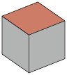

The reason for this is that Sketch by default removes polygons that are hidden. This is called culling. Read more about this in the `Missing faces and culling`_ section. To fix this problem, enable the ``Double Sided`` option in the Mesh panel and in the export script GUI. After you have done this code for the box will change to:

.. sourcecode:: sketch

    ...
    def box_polyopts [cull=false]
    def box {
      polygon[boxmat_poly,box_polyopts](1.000 ...
      polygon[boxmat_poly,box_polyopts](1.000 ...
      polygon[boxmat_poly,box_polyopts](1.000 ...
      polygon[boxmat_poly,box_polyopts](-1.00 ...
      polygon[boxmat_poly,box_polyopts](1.000 ...
    }
    ...

Finally we get a nice looking box with a transparent lid:

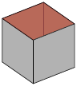

Opening the lid
~~~~~~~~~~~~~~~

What if we want to open the lid? We could of course do this in Blender, but it is more fun doing it using Sketch. In the process we will also learn why the mysterious ``lid_o``, ``lid_x``, ``lid_y``, ``lid_z`` variables are useful.

To rotate an object in Sketch you have to use the ``rotate`` `transform literal`_. It is defined as:

.. sourcecode:: sketch

    rotate(A,P,X) % scalar,point,vector
    % Rotate A degrees about point P with axis X

.. _transform literal: http://www.frontiernet.net/~eugene.ressler/sketch.html#Transform-literals

First we need to set up a new scene. Create a new sketch file and import the file generated by the export script. Remember not to export the box and lid as a stand alone file. The complete code for opening the lid is:

.. sourcecode:: sketch

    % Import objects exported from Blender
    input{boxandlid.sk}

    % Define a new scen
    def newscene {
        % Use the camera transform found in boxandlid.sk (generated by
        % the export script )
        put {view((7.481132,-6.507640,5.343665),(0.010817,-0.895343,-0.445245),[0,0,1])}{
            % show box
            {box}
            % Rotate the lid 20 degrees about (lid_o).
            % Rotation axis is [lid_y]
            put {rotate(-20, (lid_o), [lid_y])}{lid}
        }
    }

    {newscene}
    global {language tikz}

Here's the result:

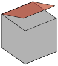

.. note::

    Rotating the ``lid`` object using

    .. sourcecode:: sketch

        rotate(-20, (lid_o), [lid_y])

    gives the same result as rotating the object in Blender using the ``RotY`` transform property:

    .. figure:: img/transformprop.png

    The location of the object center is important to get correct locations.

Adding annotations
~~~~~~~~~~~~~~~~~~

My favorite Sketch feature is that it is easy to add annotations like labels, math and lines, using `special objects`_. The `formal syntax`_ is:

.. sourcecode:: sketch

    special |raw_text|[lay=lay_value] point_list

where ``raw_text`` is arbitrary LaTeX markup, and ``point_list`` are a set of 3D coordinates. A convenient way to put points in your Blender scene is to use empties_.

.. _special objects: http://www.fauskes.net/nb/introduction-to-sketch/#specials
.. _formal syntax: http://www.frontiernet.net/~eugene.ressler/sketch.html#Specials

As shown in the figure below, I have added three empties, A, B and C, to our box with a lid scene. To get precise placement I have parented the empties to corner vertices.

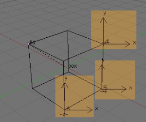

The empties add the following code:

.. sourcecode:: sketch

    def A (1.0,-1.0,-1.0)
    def B (1.0,0.999999940395,-1.0)
    def C (1.00000047684,0.999999463558,1.0)

We can now use these points to add annotations:

.. sourcecode:: sketch

    % Import objects exported from Blender
    input{boxempties.sk}

    % Define a new scene
    def newscene {
        % Use the camera transform found in boxandlid.sk (generated by
        % the export script )
        % Scale the scene by a factor two to get more room for annotations
        put {scale(2) then view((7.481132,-6.507640,5.343665),(0.010817,-0.895343,-0.445245),[0,0,1])}{
            % show box
            {box}
            % Rotate the lid 20 degrees about (lid_o).
            % Rotation axis is [lid_y]
            put {rotate(-20, (lid_o), [lid_y])}{lid}
            % Add annoations
            special |\draw[blue,very thick]
                       #1 -- node[below right] {$a$}
                       #2 -- node[right] {$b$}
                       #3 -- node[above,sloped] {$c=\sqrt{a^2+b^2}$} #1;|
                (A)(B)(C)
        }
    }

    {newscene}
    global {language tikz}

I have used TikZ to add labels and draw the triangle. The result is an interesting demonstration of Pythagoras theorem:

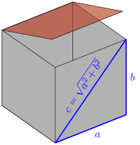

Tips and tricks
===============

Keep your meshes simple
-----------------------

The idea of Sketch is to:

    produce finely wrought, mathematically-based illustrations with no extraneous detail

Sketch is intended for simple illustrations. Keep this in mind, because exporting meshes with a huge number of faces will overwhelm TeX' limited memory capacity.

Smoother curves
---------------

Curves are exported as poly lines. You can make a curve appear smoother by increasing the default resolution of the curve in the editing panel:

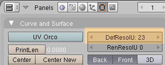

Issues and limitations
======================

- Meshes with faces and edge-only parts are not supported yet. Only the faces will be exported in this case.
- No support for grouping and parenting. All objects are currently exported as independent blocks. I will probably add support for groups in a future version.
- No shading. Sketch does not support shading and lighting yet. If your exported objects look too flat, try adding contours or manipulate the materials.
- No support for fgons/ngons yet. This means that polygons are limited to four vertices. Faces with more vertices will therefor be split into quads or triangles.

Acknowledgement
===============

I wish to thank Gene Ressler for writing Sketch and for being kind enough to add features that I needed for the export script. I also wish to thank Agostino De Marco for his valuable feedback and his very inspirational illustrations.

